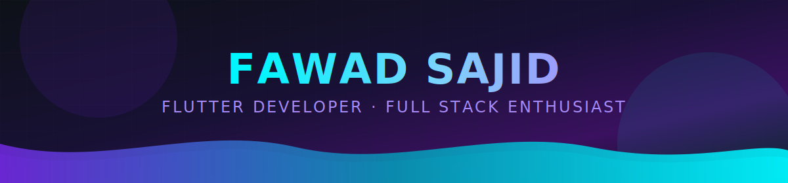
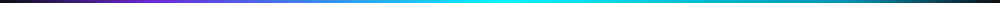

<p align="center">
  
</p>

<p align="center">
  
</p>

<p align="center">
  
</p>

<p align="center">
  
</p>

# 👋 Hi, I'm Fawad

> **Flutter Developer** • **BS Information Technology Student** • **Learning NestJS**

## 👨‍💻 About Me

- 📱 Flutter Developer
- 🎓 BS Information Technology Student
- 🌱 Learning NestJS, Firebase & Clean Architecture
- 💙 Passionate about building beautiful cross-platform apps
- 🚀 Goal: Become a Professional Flutter & Full Stack Developer

<p align="center">
  
</p>

# 📈 Skill Levels

| Skill | Level |
|------|-------|
| Flutter | █████████░ 90% |
| Supabase | ████████░░ 85% |
| Laravel | ███████░░░ 70% |
| NestJS | █████░░░░░ 55% |

<p align="center">
  
</p>

# 📊 GitHub Statistics

<p align="center">
  
</p>

<br>

<p align="center">
  
</p>

<p align="center">
  
</p>

# 🛠️ Tech Stack

<p align="center">


<br><br>


<br><br>


</p>

<p align="center">
  
</p>

# 🚀 Featured Projects

- 🎓 Student Management System
- 🍔 Foodiez Flutter App
- ⚙️ Foodiez Backend
- 🌐 Portfolio Website
- 📱 Flutter UI Collection

<p align="center">
  
</p>

# 💻 Currently Coding

```dart
class Fawad {
  final String role = "Flutter Developer";
  final String location = "Pakistan";

  final List<String> learning = [
    "Flutter",
    "Supabase",
    "Laravel",
    "NestJS",
  ];

  void keepCoding() {
    while (true) {
      buildAmazingApps();
      keepLearning();
    }
  }
}
```

<p align="center">
  
</p>

# 🎯 2026 Goals

- ✅ Master Flutter
- 🔥 Learn Advanced Supabase
- 🚀 Master NestJS
- 📱 Publish Production Apps
- 🌍 Contribute to Open Source

<p align="center">
  
</p>

# 🌐 Connect With Me

<p align="center">
  <a href="https://github.com/im-fawad">
    
  </a>
</p>

<p align="center">
<b>"Code is like humor. When you have to explain it, it's bad."</b><br>
— Cory House
</p>

<p align="center">
  
</p>

<p align="center">
⭐ Thanks for visiting my profile! ⭐
</p>
